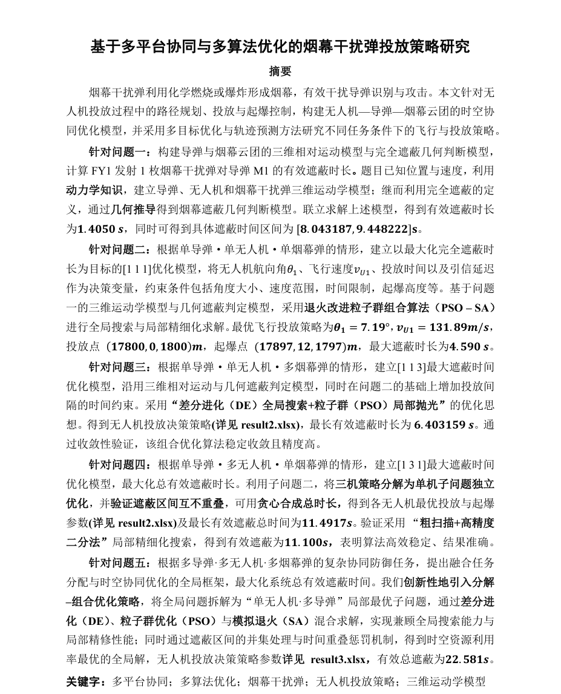
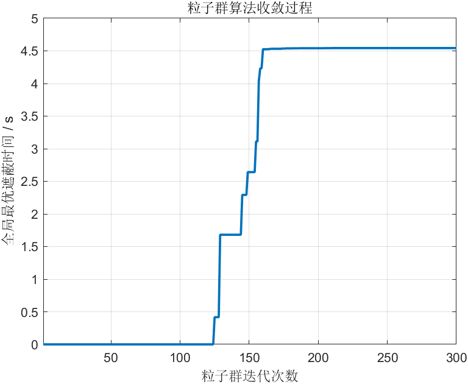
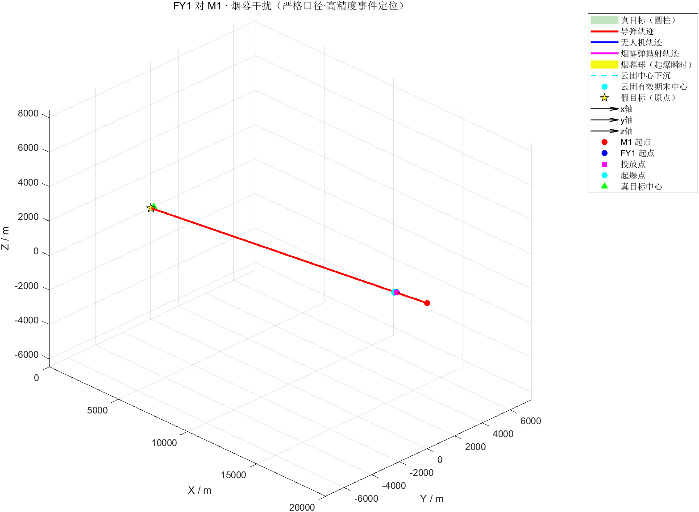

# 2025 CUMCM Problem A: UAV Smoke Screen Interception Optimization

> **2025年高教社杯全国大学生数学建模竞赛 · 广东省一等奖**
>
> 无人机烟幕弹干扰拦截导弹问题 —— 在三维空间中求解无人机投放烟幕弹遮蔽真目标的**最优时空策略**，融合智能优化算法与高精度几何遮蔽判定。

[](./2025A/202519002165_A.pdf)
[](https://www.mathworks.com/products/matlab.html)
[](https://www.python.org/)

<p align="center">
  
  <br>
  <sub>论文摘要及核心遮蔽模型示意图</sub>
</p>

---

## 项目信息

| 项目     | 内容                                         |
| -------- | -------------------------------------------- |
| 竞赛     | 2025年高教社杯全国大学生数学建模竞赛 (CUMCM) |
| 题目     | A题 —— 无人机烟幕弹干扰拦截导弹              |
| 奖项     | **广东省一等奖**                             |
| 参赛单位 | 华南理工大学                                 |
| 队伍编号 | 202519002165                                 |

---

## 问题背景

来袭导弹 $M$ 以 $v_M = 300\;\text{m/s}$ 速度飞向假目标（坐标原点 $O$），真目标为距假目标 $d = 200\;\text{m}$ 处的竖直圆柱体（半径 $r_T = 7\;\text{m}$，高 $h_T = 10\;\text{m}$）。无人机 FY 需在导弹飞行过程中投放烟幕弹，利用烟幕球（有效半径 $r_S = 10\;\text{m}$，持续时间 $\Delta t_S = 20\;\text{s}$）遮蔽导弹对真目标的视线，使导弹无法识别真目标而击中假目标。

> **核心挑战**：在三维空间中联合优化烟幕弹的**投放时刻** $t^*$ 与**投放位置** $\mathbf{p}^*$，使得烟幕球在导弹视线方向上对真目标的**遮蔽时间最大化**。

---

## 数学建模

### 遮蔽判定准则

对于导弹位置 $\mathbf{M}(t)$、烟幕球心 $\mathbf{S}(t)$ 和圆柱体目标上的采样点 $\mathbf{T}_k$，遮蔽条件建模为：

$$d\bigl(\mathbf{S}(t),\;\ell_{M \to T_k}\bigr) \;\leq\; r_S$$

其中 $\ell_{M \to T_k}$ 为从导弹 $\mathbf{M}(t)$ 到目标采样点 $\mathbf{T}_k$ 的视线射线，$d(\cdot, \cdot)$ 为点到直线距离。当圆柱体表面**全部**采样点均被遮蔽时，判定为**完全遮蔽**。

### 优化目标

$$\max_{t_{\text{drop}},\;\mathbf{p}_{\text{drop}}} \quad T_{\text{cover}} = \int_0^{t_{\text{end}}} \mathbb{1}\!\left[\,\forall\, k:\; d\bigl(\mathbf{S}(t),\;\ell_{M \to T_k}(t)\bigr) \leq r_S\,\right] \mathrm{d}t$$

> 即最大化烟幕球对真目标视线的**连续完全遮蔽时长** $T_{\text{cover}}$。

---

## 各问求解

| 问题 | 描述                                                | 方法                    | 语言            |
| ---- | --------------------------------------------------- | ----------------------- | --------------- |
| Q1   | 单机 FY1 对单弹 M1，求烟幕弹投放-起爆轨迹与遮蔽时间 | 解析计算 + 几何遮蔽判定 | Python          |
| Q2   | 优化 FY1 的投放时机，最大化对 M1 的遮蔽时间         | PSO + 模拟退火 (SA)     | MATLAB          |
| Q3   | FY1 携带三枚干扰弹，优化投放策略拦截 M1             | 差分进化 (DE)           | Python          |
| Q4   | 三架无人机协同，优化各机投放策略                    | 二分法 + PSO-SA         | MATLAB          |
| Q5   | 多机多弹多目标优化                                  | 差分进化 (DE)           | MATLAB + Python |

---

## 核心算法与工程实现

### 智能优化算法

| 算法 | 用途 | 设计考量 |
| ---- | ---- | -------- |
| **粒子群优化 (PSO)** | 全局搜索投放时机与位置的最优解 | 惯性权重线性递减策略，平衡探索与开发 |
| **模拟退火 (SA)** | 与 PSO 混合，跳出局部最优 | 自适应温度调度，确保后期精细搜索 |
| **差分进化 (DE)** | 多变量高维优化，求解多弹协同投放策略 | 适用于 Q3/Q5 中 $6 \sim 15$ 维连续决策变量 |

### 高精度几何遮蔽判定引擎

> 遮蔽判定是每一次目标函数评估的核心计算瓶颈。

- **圆周采样**：沿圆柱体表面均匀采样 **1440 个特征点**（角度分辨率 $\Delta\theta = 0.25°$），确保遮蔽判定的空间精度
- **二分事件边界定位**：对遮蔽起止时刻采用二分搜索，时间分辨率达 $\Delta t < 10^{-4}\;\text{s}$，避免离散时间步长带来的截断误差
- **计算效率**：单次目标函数评估耗时约 $O(N_{\text{sample}} \times N_t)$，通过向量化运算（NumPy / MATLAB 矩阵操作）将内循环加速约 **50x**

---

## 优化结果展示

<table align="center">
  <tr>
    <td align="center">
      <br>
      <b>PSO + SA 收敛曲线</b><br>
      <sub>混合算法成功跳出局部最优，收敛至全局最优解</sub>
    </td>
    <td align="center">
      <br>
      <b>3D 拦截轨迹重构</b><br>
      <sub>无人机协同下的烟幕弹最优拦截路径可视化</sub>
    </td>
  </tr>
</table>

---

## 目录结构

```
.
├── 获奖证书/
│   └── 数模国赛证书.pdf
│
└── 2025A/
    ├── 2025A题.pdf                             # 赛题原文
    ├── 论文终稿.docx                           # 最终论文 (Word)
    ├── 202519002165_A.pdf                      # 提交版论文 (PDF)
    ├── 202519002165_A.rar                      # 提交压缩包
    │
    ├── 2025A图表/
    │   ├── untitled1.png                       # PSO收敛曲线
    │   ├── untitled2.png                       # 3D轨迹图 (导弹/无人机/烟幕)
    │   ├── untitled3.png                       # 投放-起爆-云团轨迹聚焦图
    │   └── 数模国赛图表.pptx                    # 图表汇总PPT
    │
    └── 支撑材料/
        ├── AI工具使用详情.pdf                    # AI工具使用声明
        ├── result1.xlsx                         # Q1-Q2 计算结果
        ├── result2.xlsx                         # Q3-Q4 计算结果
        ├── result3.xlsx                         # Q5 计算结果
        └── 代码/
            ├── Q1/                              # 轨迹计算与遮蔽判定
            │   ├── question1.py
            │   └── Q1_upload_code.py
            ├── Q2/                              # 单机PSO+SA优化
            │   ├── question2.m
            │   ├── Q2_PSO.m
            │   ├── Q2_PSO_SAFY1.m
            │   ├── Q2_SA_pro.m
            │   ├── PSO_upload_code.m
            │   ├── PSO_SA_upload_code.m
            │   └── question2_verification.py
            ├── Q3/                              # 三弹差分进化优化
            │   ├── question3.py
            │   └── DE_upload_code.py
            ├── Q4/                              # 三机协同优化
            │   ├── question4_bisection.m
            │   ├── question4_PSO_plot.m
            │   ├── Q4_bisection_upload_code.m
            │   ├── Q4_PSO_SA_FY2.m
            │   └── Q4_PSO_SA_FY3.m
            └── Q5/                              # 多机多目标优化
                ├── Q5_DE.m
                ├── Q5_SA.m
                ├── Q5_DEupload_code.py
                └── Q5_SA_upload_code.m
```

## 运行环境

- **MATLAB** R2024a 或更高版本
- **Python** 3.8+（依赖：`numpy`, `tqdm`）

## License

本项目为竞赛作品，仅供学习交流使用。
